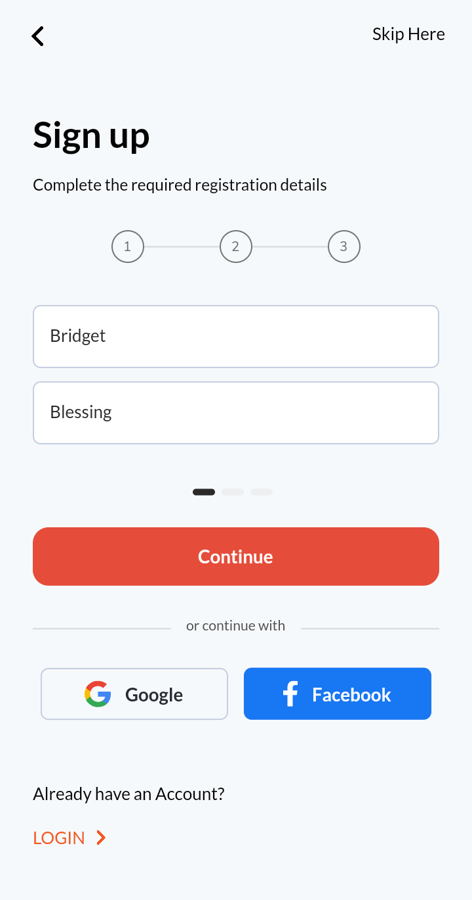

# Food Delivery Application
A mobile application for food delivery, built with Flutter/Dart.

## Tools used in building
- stacked `MVVM achitecture`
- get_it `dependency injection`
- google_fonts `on demand fonts`
- flutter `v2.0.3 - mobile sdk`

## App screenshots

